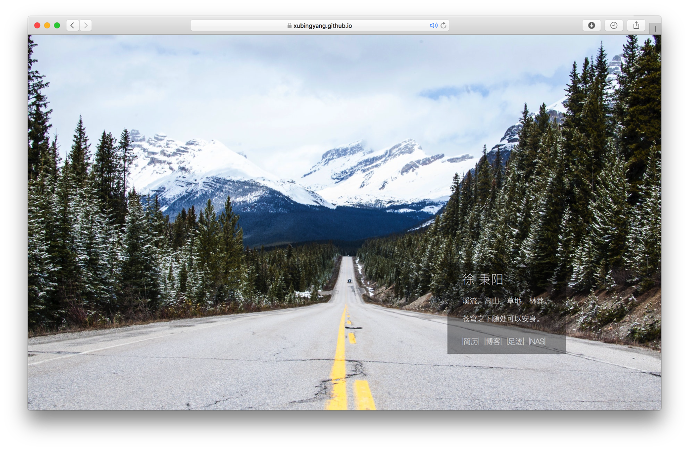

# [个人主页](https://xubingyang.com)的一个备份。

### 简单介绍
* 其实真的没什么技术，几乎就是纯HTML+CSS3+JS做的。非常简单。
* 代码几乎在前端。
* 为了效果，禁用了右击。
* 非常基本的做了Responsive效果，屏幕宽度768px为界限。
* HTML5规范下的网页字符集用的是UTF-8：```<meta charset="utf-8">```.
* 全页面用的是大陆普通话用规范汉字：```<html lang="zh-cmn-Hans">```. 
* 2023/04 Unsplash随机取图API更改，做了个[APIProxy](https://github.com/xubingyang/apiProxyServer)隐去了Public Key的前端调用。

### 关于用到的库
1. TheaterJS - 用来做文字动态字幕效果。
2. Unsplash - 利用Unsplash的简单API，来做背景图。
3. imageloaded - 判断图片是否加载完毕。


### 预览图


### 关于这两句话
无意中在网上的一个角落里发现的。原文应该是德语的，但我更喜欢断章取义汉语的翻译版，全文如下：

>上帝如果爱一个人，
>
>就叫她流浪，东奔西跑。
>
>溪流，高山，草地，林莽。
>
>苍穹之下随处可以安身。

德语的版本为网上搜集，不保证正确：

>Wem Gott will rechte Gunst erweisen,
>
>Den schickt er in die weite Welt,
>
>Dem will er seine Wunder weisen
>
>In Berg und Wald und Strom und Feld.
>
>Die Trägen, die zu Hause liegen,
>
>Erquicket nicht das Morgenrot.

### 致谢
感谢 [TheaterJS](https://github.com/zhouzi/TheaterJS), [Unsplash](https://unsplash.com), [imageloaded](https://imagesloaded.desandro.com), [Favicon Generator](http://realfavicongenerator.net), [Github Pages](https://pages.github.com).
